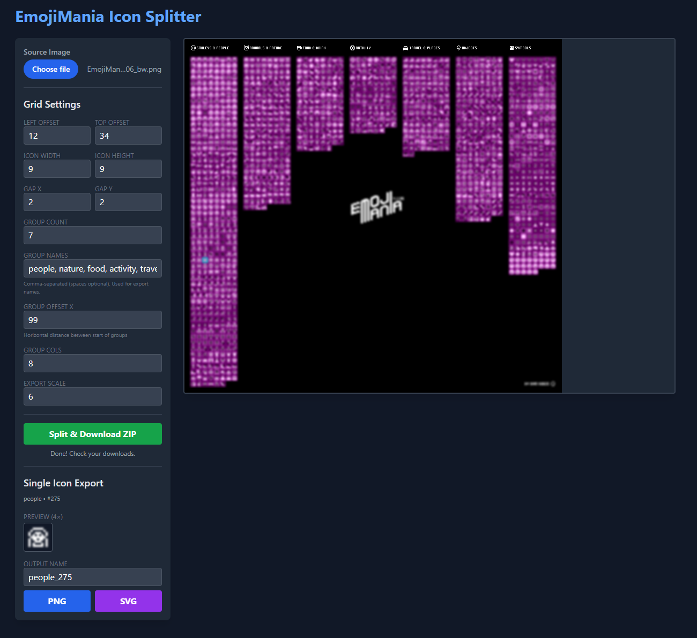

# EmojiMania Splitter

Splits an EmojiMania sprite sheet into individual **PNG** and **SVG** icons (including optional scaling), directly in the browser.

## Use

1. Open [index.html](index.html) in a browser.
2. Upload your EmojiMania sprite sheet.
3. Adjust the grid settings until the overlay lines up with the icons.
4. Click **Split & Download ZIP**.

The ZIP contains:
- `png/` (scaled using **Export Scale**)
- `svg/` (pixel-rect SVGs, scaled using **Export Scale**)

## Single Icon Export

- Click an icon in the preview to select it.
- Export that one icon as **PNG** or **SVG**.